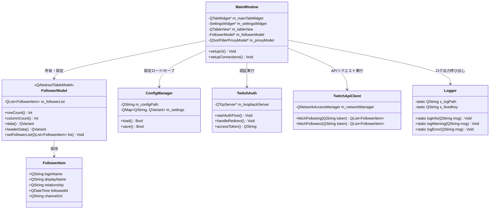

# TwitchFollowerChecker 基本設計書

本ドキュメントは、Qt6 C++で開発するTwitchフォロワーチェッカーツール（TwitchFollowerChecker）の基本設計を定義します。

---

## 1. 📂 フォルダ・ファイル構成案
プログラムおよび設定ファイルの配置設計です。アンインストール時の消し忘れを防止するため、実行ファイルと同階層の専用フォルダ内でデータを完結させます。

```text
TwitchFollowerChecker/
├── TwitchFollowerChecker.exe  # 実行ファイル
├── TransCipher.dll            # 難読化・データ保護DLL（実行時に必要）
├── config/                    # 設定ファイル格納用フォルダ（事前作成）
│   └── config.tcf             # 難読化済みのアプリケーション設定ファイル
├── logs/                      # ログ出力用フォルダ
│   └── app.tcf                # 難読化済みのアプリケーション実行ログ
└── doc/                       # 開発ドキュメント類
    ├── requirements_definition.md
    └── basic_design.md
```

---

## 2. 🖥️ 画面構成・UI設計

### 2.1. 画面レイアウト概要
メインウィンドウは、設定項目と情報表示エリアを明確に分けるため、**2大メインタブ構造**を採用します。

```
┌────────────────────────────────────────────────────────┐
│ TwitchFollowerChecker - Ver 1.0.0                      │
├────────────────────────────────────────────────────────┤
│  [🔍 フォロワーチェッカー]   [⚙️ システム設定]           │ <- メイン・タブ
├────────────────────────────────────────────────────────┤
│                                                        │
│  【 Twitch連携状態: 未認証 】  [🔑 認証ログイン]        │
│                                                        │
│  ┌──────────────────────────────────────────────────┐  │
│  │ [全て]  [相互]  [フォローのみ]  [フォロワーのみ] │  │ <- サブ・タブ
│  ├──────────────────────────────────────────────────┤  │
│  │ ログイン名 │ 表示名 │ 関係 │ フォロー開始日 │ URL  │  │ <- テーブル
│  │ ───────────┼────────┼──────┼────────────────┼───── │  │
│  │ streame... │ 配信者 │ 相互 │ 2026-05-26     │ ht.. │  │
│  └──────────────────────────────────────────────────┘  │
│                                                        │
│  [📊 差分チェック実行]                  [📥 CSV出力]   │
└────────────────────────────────────────────────────────┘
```

### 2.2. 定数設計（タブ文言・テーブルヘッダー）
文言の将来的な変更に柔軟に対応するため、UIテキストはすべてヘッダーファイルにて定数定義（`const QString`）します。

```cpp
namespace UIConstants {
    // メインタブ
    const QString MAIN_TAB_CHECKER = "🔍 フォロワーチェッカー";
    const QString MAIN_TAB_SETTINGS = "⚙️ システム設定";

    // サブタブ（関係分類）
    const QString SUB_TAB_ALL = "全て";
    const QString SUB_TAB_MUTUAL = "相互";
    const QString SUB_TAB_FOLLOWING = "フォローのみ";
    const QString SUB_TAB_FOLLOWERS = "フォロワーのみ";

    // テーブルヘッダー
    const QString HEADER_LOGIN_NAME = "ログイン名";
    const QString HEADER_DISPLAY_NAME = "表示名";
    const QString HEADER_RELATIONSHIP = "関係";
    const QString HEADER_FOLLOW_DATE = "フォロー開始日";
    const QString HEADER_CHANNEL_URL = "チャンネルURL";
}
```

### 2.3. デザイン・カスタマイズ仕様
* **デフォルトテーマ**: 高級感のあるプレミアム・ダークモードを採用。
* **背景画像設定機能**: ユーザーが設定画面から任意の画像（PNG/JPG）を指定し、メインウィンドウの背景に設定（アスペクト比を維持してフィット）できます。
* **文字色カスタマイズ機能**: 設定画面のカラーパレット（`QColorDialog`）または直接入力された16進数カラーコード（例: `#FF55FF`）によって、テキスト色を動的に変更可能です。
* **ユーザー指定フォント機能**: 設定画面からフォント選択ダイアログ（`QFontDialog`）を起動し、アプリ内の表示フォント（フォントファミリー、サイズ、太さなど）を自由に変更できます。

---

## 3. ⚙️ 設定保存 ＆ セッション設計

### 3.1. 設定ファイル（.tcf）設計
設定情報はJSONフォーマットで構築し、ローカル難読化ライブラリ `CipherEngine` を使用してバイナリ暗号化を行い、拡張子 `.tcf` で保存します。

* **保存ファイルパス**: `config/config.tcf`（実行ファイル同階層）
* **データ構造（復号時）**:
```json
{
  "get_following": true,
  "get_followers": true,
  "compare_lists": true,
  "custom_client_id": "",
  "custom_client_secret": "",
  "custom_text_color": "#E1E1E6",
  "background_image_path": "",
  "custom_font": ""
}
```

### 3.2. セッション情報のライフサイクル設計
TwitchのOAuthアクセストークンは、セキュリティ向上のため **ローカルディスク（.tcf）には永続保存しません。**

* **セッションの維持期間**: アプリ起動中（オンメモリ）のみ保持。
* **再認証ルール**: 
  1. アプリケーションを再起動した時。
  2. 実行中にトークン有効期限が切れる（APIが401エラーを返す）等でセッションが切れた時。
  * 上記のタイミングでは、ユーザーが明示的に「認証ログイン」ボタンを押してブラウザ経由でログイン処理をやり直す仕様とします。

### 3.3. ログの難読化（暗号化）出力設計
アプリケーションの実行状況やエラーを記録するログファイルについて、第三者への機密情報漏洩を防ぎつつ、開発者がトラブルシューティングを行えるようにするため、難読化した状態で出力します。

* **保存ファイルパス**: `logs/app.log`
* **難読化キー（ログ用）**: 固定の文字列キー（例: `"BLUE000_LOG_FIXED_KEY"`）をコード内に定義し、これを用いて暗号化します。
* **出力方式（行単位暗号化）**:
  * アプリが強制終了（クラッシュ）した場合でもログが破損しないようにするため、**「1回のログ出力（1行）ごとに暗号化を実行し、Base64文字列に変換してファイルへ追加書き込み（Append）」**します。
  * 解析時は、開発者が持っている固定キーを用いて、ログファイルを1行ずつ復号（デコード）して確認します。

---

## 4. 🗃️ CSV出力仕様（Excel文字化け対策）

* **出力項目（共通）**: 画面表示と同じ5つのカラムを出力します。
  `ログイン名`, `表示名`, `関係`, `フォロー開始日`, `チャンネルURL`
* **Excel文字化け対策 (BOMの付与)**:
  Windows上のExcelでCSVファイルを直接開いた際に日本語文字化けが発生するのを防ぐため、**UTF-8のBOM（Byte Order Mark）である `\xEF\xBB\xBF`（3バイト）をファイルの先頭に必ず書き込みます。**

---

## 5. 🏗️ クラス・アーキテクチャ設計（Model/Viewの責務分離）

Qtの `Model/View/Proxy` アーキテクチャを最大限に活用し、表示処理・ソート処理をモデル側へ委譲します。また、配列やリスト構造には安全な `QList` を採用し、インデックスによる直接ループアクセスを避けます。



---

## 6. 📝 コーディング基準 ＆ ベストプラクティス

### 6.1. 安全な `QList` の探索（インデックス不使用）
リスト内の要素を探索する際は、要素数（インデックス）を用いた従来の `for(int i=0; i<list.size(); ++i)` は避け、C++11の**範囲ベースforループ**または**イテレータ**、Qtのイテレータアルゴリズムを使用します。

```cpp
// 範囲ベースforループによる安全な探索例
QList<FollowerItem> followers = ...;
for (const auto& item : followers) {
    if (item.loginName == targetName) {
        // 処理
    }
}
```

### 6.2. マジックナンバーの完全排除
レイアウトの間隔設定や特定のステータスコードなど、すべての固定値は名前付き定数（`constexpr` や `enum class`）として定義します。

### 6.3. 関数ヘッダーコメントの記述ルール
すべての関数ヘッダーには、処理の目的とI/O（入力パラメータ、出力値、例外条件）が明示的に伝わる構造化コメントを記述します。

```cpp
/**
 * @brief Twitch APIから取得したデータを基に関係状態を照合・分類する
 * @param followingList 自分がフォローしているユーザー一覧 (Input)
 * @param followerList 自分をフォローしているユーザー一覧 (Input)
 * @return 照合・分類された FollowerItem のマージリスト (Output)
 */
QList<FollowerItem> compareFollowers(const QList<FollowerItem>& followingList, 
                                     const QList<FollowerItem>& followerList);
```

### 6.4. ヌル文字（`\0`）の混入防止（難読化・認証対策）
暗号ライブラリからの復号時、またはOAuth連携による外部文字列受信時に、バイナリバッファのパディング等の理由で文字列の末尾や途中に **ヌル文字（`\0`）が混入する不具合を完全に防止します。**

* **問題点**: 
  `QString` 内部に `\0` が混入したままWeb APIのリクエストヘッダー（`Authorization: Bearer <token>\0`）等に使用されると、HTTPヘッダー解析エラーやトークン不一致（401）等の原因不明の通信エラーを引き起こします。
* **防止策**: 
  1. 復号されたバイト配列（`QByteArray`）を `QString` に変換する際は、`\0` を完全に除去するか、最初の `\0` までの文字列として切り詰めます。
  2. トークンや認証情報をネットワークリクエストに使用する前に、明示的に `\0` を除去します。

```cpp
// ヌル文字除去処理の徹底例
QString sanitizedToken = decryptedToken;
sanitizedToken.remove(QChar('\0')); // 文字列内のヌル文字を安全に完全除去
sanitizedToken = sanitizedToken.trimmed(); // 前後の空白・制御文字を除去
```
